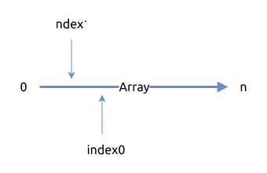

# 0026. 删除有序数组中的重复项 Remove Duplicates from Sorted Array

[问题描述](../problems/0026.remove-duplicates-from-sorted-array/content.html)

要注意的一点是, 这个数组已经是有序的了.

## 方法1, 双指针法



```rust
{{#include src/main.rs:40:44 }}
```

## 方法2, 使用 Vec 自带的去重方法

`Vec::dedup()` 就是用来去重的, 如果它已经是排序的了, 可以去掉所有重复元素.

```rust
{{#include src/main.rs:40:44 }}
```