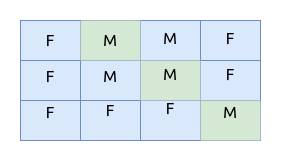

# 最大相连男生数/学生方阵

## 题目描述

学校组织活动, 将学生排成一个矩形方阵.

请在矩形方阵中找到最大的位置相连的男生数量.

这个相连位置在一个直线上, 方向可以是水平的, 垂直的, 成对角线的或者呈反对角线的.

注: 学生个数不会超过10000

### 输入描述

输入的第一行为矩阵的行数和列数, 接下来的n行为矩阵元素, 元素间用`,`分隔.

### 输出描述

输出一个整数, 表示矩阵中最长的位置相连的男生个数.

### 示例1

输入:

```text
{{#include assets/input1.txt}}
```

输出:

```text
{{#include assets/output1.txt}}
```

说明:



## 题解

### Python

```python
{{#include solution.py:6:}}
```