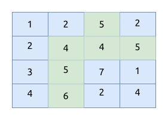
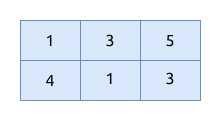

# 机器人活动区域

## 题目描述

现有一个机器人, 可放置于 M × N 的网格中任意位置, 每个网格包含一个非负整数编号, 当相邻网格的数字编号差值的绝对值小于等于
1 时,
机器人可以在网格间移动.

问题: 求机器人可活动的最大范围对应的网格点数目.

说明: 网格左上角坐标为 (0, 0), 右下角坐标为 (m−1, n−1), 机器人只能在相邻网格间上下左右移动.

### 输入描述

- 第 1 行输入为 M 和 N
    - M 表示网格的行数
    - N 表示网格的列数
- 之后 M 行表示网格数值, 每行 N 个数值 (数值大小用 k 表示), 数值间用单个空格分隔, 行首行尾无多余空格
    - M, N, k 均为整数
    - 1 ≤ M, N ≤ 150
    - 0 ≤ k ≤ 50

### 输出描述

输出 1 行, 包含 1 个数字, 表示最大活动区域的网格点数目, 行首行尾无多余空格.

### 示例1

输入:

```text
{{#include assets/input1.txt}}
```

输出:

```text
{{#include assets/output1.txt}}
```

说明: 如下图, 图中红色区域, 相邻网格差值绝对值都小于等于 1, 且为最大区域, 对应网格点数目为 6.



### 示例2

输入:

```text
{{#include assets/input2.txt}}
```

输出:

```text
{{#include assets/output2.txt}}
```

说明: 任意两个相邻网格的差值绝对值都大于1, 机器人不能在网格间移动, 只能在单个网格内活动, 对应网格点数目为1.



## 题解

使用 广度优先搜索 BFS 求得最大的连接节点数.