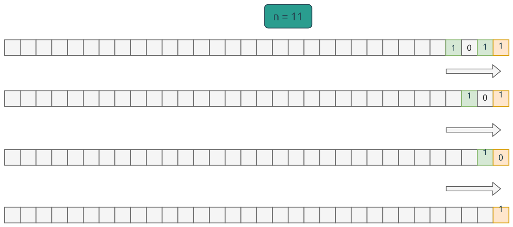

# 0191. Number of 1 Bits

这个题目考察位操作的.

先考虑比特位操作的函数表:

| A | B | A OR B | A AND B | A XOR B | NOT A |
|---|---|--------|---------|---------|-------|
| 1 | 1 | 1      | 1       | 0       | 0     |
| 1 | 0 | 1      | 0       | 1       | 0     |
| 0 | 1 | 1      | 0       | 1       | 1     |
| 0 | 0 | 0      | 0       | 0       | 1     |

其次是如何遍历 u32 的所有比特位? 是的, 用右位移 (shift right), 依次将每一个比特位右移到最低位,
然后结合上面的 bitwise `AND` 操作, 就可以取出这个比特位的值, 是 0 或者 1.



想明白了上面的过程, 代码就比较容易了.

```rust
pub fn solution3(n: u32) -> i32 {
    let mut count = 0;
    for i in 0..32 {
        count += n >> i & 1;
    }
    count as i32
}
```

或者使用函数式风格的写法:

```rust
pub fn solution4(n: u32) -> i32 {
    (0..32).map(|i| n >> i & 1).sum::<u32>() as i32
}
```