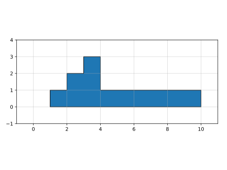
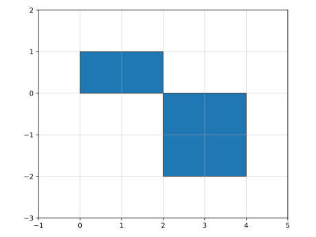

# 计算面积/绘图机器

## 题目描述

绘图机器的绘图笔初始位置在原点 `(0,0)` 机器启动后按照以下规则来进行绘制直线.

1. 尝试沿着横线坐标正向绘制直线直到给定的终点E
2. 期间可以通过指令在纵坐标轴方向进行偏移, offsetY为正数表示正向偏移, 为负数表示负向偏移

给定的横坐标终点值E 以及若干条绘制指令, 请计算绘制的直线和横坐标轴以及 x=E 的直线组成的图形面积.

### 输入描述

- 首行为两个整数 N 和 E
- 表示有N条指令,机器运行的横坐标终点值E
- 接下来N行, 每行两个整数表示一条绘制指令x offsetY
- 用例保证横坐标x以递增排序的方式出现
- 且不会出现相同横坐标x

取值范围:

- 0 < N <= 10000
- 0 <= x <= E <= 20000
- -10000 <= offsetY <= 10000

### 输出描述

一个整数表示计算得到的面积, 用例保证结果范围在0到 4294967295 之内.

### 示例1

输入:

```text
{{#include assets/input1.txt}}
```

输出:

```text
{{#include assets/output1.txt}}
```

说明:



### 示例2

输入:

```text
{{#include assets/input2.txt}}
```

输出:

```text
{{#include assets/output2.txt}}
```

说明:



## 题解

### Python

```python
{{#include solution.py:6:}}
```