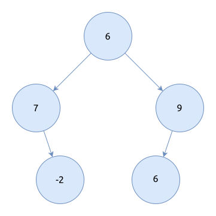
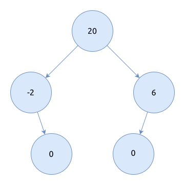

# 二叉树计算

题目描述

给出一个二叉树如下图所示:



请由该二叉树生成一个新的二叉树, 它满足其树中的每个节点将包含原始树中的左子树和右子树的和.



左子树表示该节点左侧叶子节点为根节点的一颗新树, 右子树表示该节点右侧叶子节点为根节点的一颗新树.

### 输入描述

2行整数, 第1行表示二叉树的中序遍历, 第2行表示二叉树的前序遍历, 以空格分割.

### 输出描述

1行整数, 表示求和树的中序遍历, 以空格分割.

### 示例1

输入:

```text
{{#include assets/input1.txt}}
```

输出:

```text
{{#include assets/output1.txt}}
```

## 题解

### Python

```python
{{#include solution.py:6:}}
```