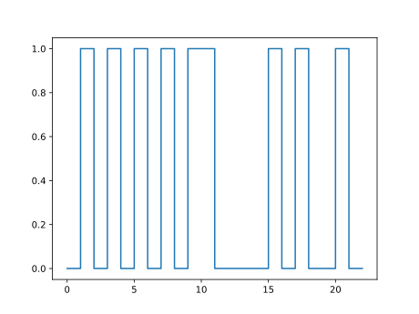

# 最长连续方波信号

## 题目描述

输入一串方波信号, 求取最长的完全连续交替方波信号, 并将其输出, 如果有相同长度的交替方波信号, 输出任一即可.
方波信号高位用1标识, 低位用0标识.



说明:

- 一个完整的信号一定以0开始然后以0结尾, 即010是一个完整信号, 但101, 1010, 0101不是
- 输入的一串方波信号是由一个或多个完整信号组成
- 两个相邻信号之间可能有0个或多个低位, 如0110010, 011000010
- 同一个信号中可以有连续的高位, 如01110101011110001010, 前14位是一个具有连续高位的信号
- 完全连续交替方波是指10交替, 如01010是完全连续交替方波, 0110不是

### 输入

输入信号字符串, 长度 >= 3 且 <= 1024:

例如: 0010101010110000101000010

注: 输入总是合法的, 不用考虑异常情况.

### 输出

输出最长的完全连续交替方波信号串.

例如: 01010

若不存在完全连续交替方波信号串, 输出 -1.

### 示例1

输入:

```text
{{#include assets/input1.txt}}
```

输出:

```text
{{#include assets/output1.txt}}
```

## 题解

### Python

```python
{{#include solution.py:5:}}
```