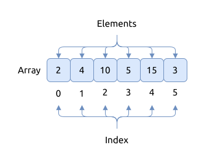

# 数组 Arrays

数组是计算机科学中最基础最常用的一种数据结构, 它几乎无处不在.

数组是一种线程数据结构, 它可以存储一系列有着相同数据类型并占用相同内存大小的元素.

数组的特点有:

- 它在内存中是一块连续的内存
- 每个元素在数组中都占用一个唯一的独特的索引编号, 其中的第一元素编号是 0
- 对其中的任意元素进行访问的时间一致, 支持随机访问

数组基本的布局如下图如示:

根据元素分布方式, 可以将数组分类为:

- 一维数组 (one dimensional array), 数组中只存储一行元素, 这也是本章要介绍的
- 多维数组 (multi-dimensional array), 数组中存储多行元素, 又称为 [矩阵 matrix](../matrix/index.md), 在后面章节有介绍