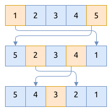

# 反转数组 Reverse

反转数组, 就是将数组中各元素转换到它相反的位置:

- 第一个位置的元素移到最后一位
- 第二个位置的元素移到倒数第二位
- 依次类推

得到的结果如下图所示:


## 操作过程

根据反转数组的描述, 使用[靠拢型双指针法](../two-pointers/close-up.md)遍历整个数组, 并交换元素的值.

操作步骤如下图所示:



## 代码实现

```rust
{{#include assets/reverse.rs:8:}}
```