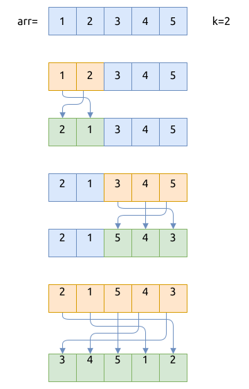

# 旋转数组 Rotate

给定一个数组, 包含 `n` 个元素, 要求将数组中的元素都依次向左移动 `k` 个位置. 如果 `k` 小于0, 就向右移动.
比如:

- 输入: `arr = [1, 2, 3, 4]; k = -2`, 输出: `arr = [3, 4, 1, 2]`
- 输入: `arr = [1, 2, 3, 4]; k = 1`, 输出: `arr = [2, 3, 4, 1]`

首先先将问题简化:

- 如果向右移动 `k` 个位置, 其实就相当于向左移动了 `n-k` 个位置; 所以我们刚开始只需要考虑左移的问题
- 如果向左移动了 `c * n + k` 个位置, 就相当于向左移动了 `k` 个位置, 因为经过 `c * n` 轮移动后, 元素位置并没有变化

## 方法1: 使用临时数组, 拷贝一份

操作过程如下:

1. 将 `arr[k..n]` 存储到临时数组
2. 将 `arr[0..k]` 存储到临时数组
3. 将临时数组中的元素拷贝回原数组

这个方法的时间复杂度是 `O(n)`, 空间复杂度是 `O(n)`.

代码如下:

```rust
{{#include assets/rotate.rs:7:50}}
```

## 方法2: 使用数组反转

操作过程如下:

1. 将 `arr[k..n]` 进行反转
2. 将 `arr[0..k]` 进行反转
3. 将 `arr[..]` 进行反转

这个方法是在原地操作的, 其时间复杂度是 `O(n)`, 空间复杂度是 `O(1)`.

流程如下图所示:



代码如下:

```rust
{{#include assets/rotate.rs:52:83}}
```