# 冒泡排序 Bubble Sort

该算法将数组分成了两个部分, 左侧部分是未排序的, 右侧部分是已排序好的.

## 排序的步骤

1. 从左到右遍历数组, 比较相邻的元素, 将较大的元素放在右侧
2. 重复这个过程, 这样最大的元素就会放在数组最右侧
3. 重复步骤1-2, 找到第二大的元素, 并放在数组右侧第二个位置
4. 直到没有元素需要被交换, 整个数组变得有序

下面以 `arr = [9, 4, 1, 7]; `为例来进行演示.

第一阶段, 从左到右遍历数组, 找到最大的元素 `9`, 并将它放在数组最右侧.



第一阶段, 从左到右遍历数组, 找到最大的元素 `7`, 并将它放在数组右侧第二个位置.



第一阶段, 从左到右遍历数组, 发现数组已排序完成.



## 实现冒泡排序算法

```rust
{{#include assets/bubble_sort.rs:5:27}}
```

## 递归实现冒泡排序

根据上面的描述, 冒泡排序的第一步, 将最大的元素移到数组最右侧; 在第二步中, 将第二大的元素移到右侧第二位.
基于此, 就可以编写递归形式的冒泡排序算法:

1. 如果数组长度为1, 就直接返回
2. 将最大的元素移到数组最右侧
3. 递归调用冒泡排序, 但忽略数组的最右侧元素

```rust
{{#include assets/bubble_sort.rs:29:55}}
```

## 冒泡排序的特点

- 时间复杂度是 `O(N^2)`, 空间复杂度是 `O(1)`
- 在交换元素时, 只与相邻的元素交换, 交换次数可能比较多
- 属于稳定排序 (stable sort)
- 是 adaptive sort
- 比较适合已经基本排序好的数组, 可以显著提高排序效率; 对于已排序好的数组, 时间复杂度是 `O(N)`
- 只适合元素比较少的数组