# 选择排序 Selection Sort

选择排序的逻辑很简单, 将数组分成两部分:

- 左侧部分是排序好的, 按顺序放着较小的元素
- 右侧部分是未排序的, 放着较大的元素

## 选择排序的步骤

1. 遍历数组, 找到最小的元素, 让它与最左侧元素交换
2. 遍历数组中剩下的元素, 找到最小的元素, 让它与最左侧第二位元素交换
3. 重复上面的步骤, 直到所有元素都有序排列

我们以 `arr = [9, 4, 1, 7];` 为例进行演示:

首先找到最小的元素 `1`, 把它与最左侧元素相交换:



第二阶段, 找到剩下元素中最小的元素 `4`, 把它与左侧第二位相交换:



第三阶段, 找到最小的元素 `7`, 把它与左侧第三个元素相交换:



到达了数组的最右侧, 所有元素都已排好序.

## 选择排序的代码实现

```rust
{{#include assets/selection_sort.rs:5:24}}
```

## 选择排序的特点

1. 即使数组中的元素基本排序好, 也需要遍历所有元素并比较大小, 这种情况下效率较低, 依然需要 `N^2 / 2` 次比较操作
2. `N^2 / 2` 次比较以及 N 次交换, 平均时间复杂度是 `O(NlogN)`, 空间复杂度是 `O(1)`
3. 在所有排序算法中, 选择排序移动元素的次数最少, 每个元素最多只移动一次, 就可以移到最终位置;
   这个算法比较适合那种比较元素时的成本低, 但移动元素成本比较高的情况 (比如, 移动文件中的内容)