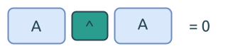

# 对自己异或操作结果为0

这个问题考察的是比特位异或操作中的一个重要特性: `A XOR A == 0`.

我们可以利用这个特性, 遍历数组中的每一项, 然后计算异或值, 最后的结果就是那个单值.



## Single Number

这个思路, 可以用于快速[消除数组中出现偶数次的元素](https://leetcode.com/problems/single-number/).

## 交换两个数值

或者, 不使用临时变量, 交换两个变量的值:

```rust
{{#include assets/swap_number.rs:5: }}
```
