# 0125. 验证回文串 Valid Palindrome

[问题描述](../problems/0125.valid-palindrome/content.html)

## 靠拢型双指针

这是一个典型的双指针问题, 相关介绍可以看[这里](../../two-pointers/close-up.md).


```rust
{{#include src/main.rs:5:29 }}
```

## 利用回文的特性

回文的特性就是, 把它反转过来, 会得到一样的结果.

我们只需要反转字符串, 并与原字符串对比一下就能确定, 它是不是回文.



```rust
{{#include src/main.rs:31:39 }}
```