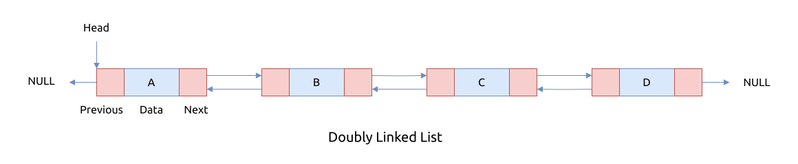

# 双链表 Doubly Linked List

相对于前文提到的单链表, 双链表 doubly linked list (DLL) 中每个节点包含两个指针, 分别指向左右相邻的节点.

其结构如下图所示:



双链表的优点:

- 反转双向链表非常容易
- 它可以在执行过程中轻松分配或重新分配内存
- 与单链表一样, 它是最容易实现的数据结构
- 此双向链表的遍历是双向的, 这在单链表中是不可能的
- 与单链表相比, 删除节点很容易. 单链表删除需要指向要删除的节点和前一个节点的指针, 但在双向链表中, 它只需要要删除的指针.
  与其他数据结构 (如数组) 相比, 双向链表的开销较低
- 可用于实现图算法 graph algorithms

双链表的不足:

- 与数组和单链表相比, 它使用额外的内存来存储左侧相邻接点
- 由于内存中的元素是随机存储的, 因此元素是按顺序访问的, 不允许随机访问
- 遍历双向链表可能比遍历单链表慢
- 实现和维护双向链表可能比单链表更复杂

双链表的应用场景:

- 它用于需要前后双向访问的系统
- 浏览器使用它来实现访问过的网页的前后导航, 即后退和前进按钮
- 它也用于表示经典的纸牌游戏
- 各种应用程序也使用它来实现撤消和重做功能
- 双向链表也用于构建 MRU/LRU (最近使用/最近最少使用) 缓存系统
- 其他数据结构, 如堆栈, 哈希表, 二叉树也可以使用双向链表构建或编程
- 在许多操作系统中, 线程调度程序 scheduler (选择哪个进程需要在什么时候运行的东西) 维护当时运行的所有进程的双向链表
- 实现图算法

## 链表的节点信息

我们使用单独的链表表头来记录链表的头尾节点信息, 同时还单独记录链表中节点的个数 `len`.

每个节点包含两个指针分别指向左右相邻节点, 同时在节点上存储元数的值.

其结构大致如下:

```rust, no_run
{{#include assets/doubly_linked_list.rs:11:25}}
```

## 插入节点

## 批量插入节点

## 移除节点

## 访问节点

只有头部节点和尾部节点可以直接访问, 其它节点需要遍历之后才能访问.

```rust, no_run
{{#include assets/doubly_linked_list.rs:59:85}}
```

## 迭代器

## 反转链表

## 链表分隔

## 合并链表

## 算法实现

```rust
{{#include assets/doubly_linked_list.rs:5:}}
```