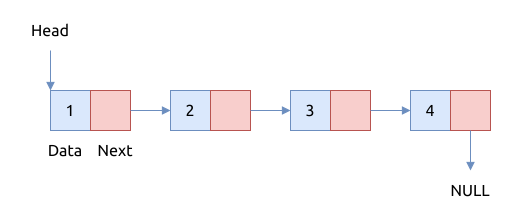

# 链表 List

与 [数组](../array/index.md) 类似, 链表也是计算机科学里的常用的数据结构.

与数组相比, 链表的最大特点是:

- 支持高效地在任意节点位置插入和删除元素
- 在内存中非连续地存储各个元素
- 不支持随机访问各个元素

链表是线性数据结构 (linear data structure), 它由一系列的节点组成; 节点内部保存着元素的值,
节点之间使用指针或者引用引连, 可以顺着指针/引用找到下个节点在内存中的位置.

