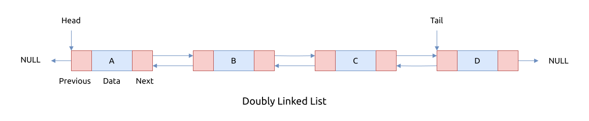

# 链表的类型

根据链表的结构, 有这几种类型:

- 单链表 singly linked list
- 双链表 doubly linked list
- 环状链表 circular linked list
- 环状双链表 doubly circular linked list
- header linked list
- multiply linked list
- unrolled linked list

## 单链表 Singly Linked List

在单链表中, 每个节点包括一个指针, 指向下个节点.

特点:

- 只能从链表头部单向地遍历整个链表
- 每个节点只需要存储一个指针元素, 可以节省一些内存空间

单链表的结构如下图所示:


C语言中对应的结构体声明如下:

```C
{{#include assets/list-types.c:5:9}}
```

## 双链表 Doubly Linked List

在双链表中, 每个节点持有两个指针, 分别指向它的前一个节点以及后一个节点.

特点:

- 可以向前和向后双向遍历整个链表
- 每个节点要存储两个指针, 占用更多的内存空间

双链表的结构如下图所示:



C语言中对应的结构体声明如下:

```C
{{#include assets/list-types.c:11:16}}
```

## 环状链表 Circular Linked List

与单链表不同, 环状链表的最后一个节点指向链表的第一个节点, 形成一个环.

特点是:

- 遍历环状链表一周后, 可以回到起始节点

环状链表的结构如下图所示:


C语言中对应的结构体声明如下:

```C
{{#include assets/list-types.c:18:22}}
```

## 环状双链表 Doubly Circular Linked List

与双链表不同, 环状双链表的首尾节点也有指针相互链表, 所以它里面不存在指向空节点的指针.

特点:

- 支持向前向后双向遍历
- 遍历链表一周之后会回到起始点

环状双链表的结构如下图所示:


C语言中对应的结构体声明如下:

```C
{{#include assets/list-types.c:24:29}}
```

## Header Linked List

这种链表是对单链表的改进, 在实现的编码中, 如果链表指针指向链表中的第一个节点时, 有很多操作,
比如删除节点或者交换节点的操作, 处理起来比较麻烦, 需要单独考虑第一个节点.

为此, 我们可以在第一个节点之前再加一个 `header node`, 或者称为 `dummy node`, 链表的指针
指向该节点, 然后该节点再指向链表的真正存放数据元素的第一个节点.

特点:

- 支持向后单向遍历节点
- 更方便针对链表节点的操作

该链表的结构如下图所示:


C语言中对应的结构体声明如下:

```C
{{#include assets/list-types.c:24:29}}
```

## Multiply Linked List

上面介绍的双链表, 每个节点有两个指针分别指向节点的前后相邻节点.

如果一个节点中有多个指针指向别的节点呢? 这就是 Multiply Linked List, 或者称为 Multi-Linked List.

特点:

- 节点之间有多个连接
- 遍历节点的方式有多种

C语言中的结构体声明如下:

```C
{{#include assets/list-types.c:37:42}}
```

该类链表可以表示基于不同方式排序节点, 比如用于记录个人信息:

```C
struct person {
  char* name;
  int age;
};
```

记录个人信息的列表, 可以基于人的姓名排序, 也可以基于年龄排序, 其结构图如下所示:


或者展示稀疏矩阵:

| - | 0  | 1 | 2  |
|---|----|---|----|
| 0 | 0  | 5 | 0  |
| 1 | 0  | 0 | 0  |
| 2 | 20 | 0 | 10 |
| 3 | 6  | 0 | 0  |

使用以下数据结构:

```C
{{#include assets/sparse-matrix.c:5:}}
```

其结构图如下所示:


或者表示多层链表 Multi-level linked list, 或者称为 List of list, 如下图所示:


## Unrolled Linked List