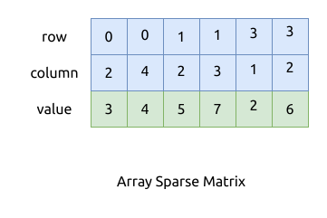

# 数组

数组表示法来存储稀疏矩阵, 就是只在数组中存储里面非零的元素.

数组中每个元素项都包含三部分:

- 该元素在矩阵中的行号
- 该元素在矩阵中的列号
- 该元素的值

比如:

\begin{bmatrix} \\
0 & 0 & 3 & 0 & 4 \\\\
0 & 0 & 5 & 7 & 0 \\\\
0 & 0 & 0 & 0 & 0 \\\\
0 & 2 & 6 & 0 & 0 \\
\end{bmatrix}

这个矩阵用数组存放, 效果如下图:



这种存储方式的特点是:

- Row major 风格
- 数组中元素的排序方法是
    - 从头到尾以行编号递增
    - 相同行编号时, 以列编号递增
    - 即整体上行编号有序递增, 整体上列编号无序, 但局部上列编号递增
- 查找矩阵中某个节点的值时的性能是 `O(log(m) * log(n))`, 其中 `m` 和 `n` 是矩阵中非 0 元素的最大行列数,
  因为是有序排列的, 可以用二分查找法
- 比较适合存放固定不变的矩阵, 插入或者删除元素的成本比较高

## 算法的实现

这里只实现了构造稀疏矩阵和查找元素等少数方法.

```rust
{{#include assets/array_sparse_matrix.rs:5:86}}

{{#include assets/traits.rs:5:}}
```