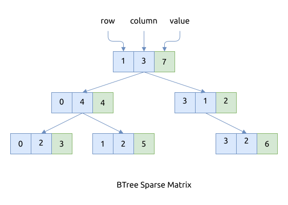

# BTree

以下面的矩阵为例:

\begin{bmatrix} \\
0 & 0 & 3 & 0 & 4 \\\\
0 & 0 & 5 & 7 & 0 \\\\
0 & 0 & 0 & 0 & 0 \\\\
0 & 2 & 6 & 0 & 0 \\
\end{bmatrix}

这个矩阵用数组存放, 效果如下图:



这种存储方式的特点是:

- BTree 中节点是按照 key 的顺序进行存储的, 而我们选用 (row, column) 作为 key, 这样
    - 首先以行号递增排序
    - 如果行号相同, 以列号递增排序
- 查找/插入/删除矩阵中某个节点的值时的性能是 `O(log(m * n))`, 其中 `m` 和 `n` 是矩阵中非 0 元素的最大行列数
- 比较适合存放随时增减节点的矩阵, 插入或者删除元素的成本比较低, 很灵活
- 支持范围查找, 比如查找某一行中所有的列
- 实现简单

## 算法的实现

使用 BTree 进行存储, 实现起来最简单, 因为我们要求的接口与 BTreeMap 本身的接口非常匹配, 需要额外
花费的精力很少.

```rust
{{#include assets/btree_sparse_matrix.rs:5:73}}
```