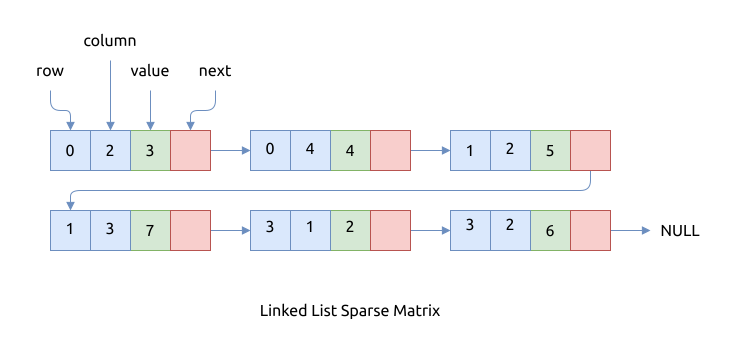

# 链表

上文介绍了使用数组存储稀疏矩阵的方法, 但该方法不适合动态地插入和删除元素.
我们可以换成链表来存储, 链表上删减节点的操作很灵活.

链表中每个节点项都包含这几部分:

- 该元素在矩阵中的行号
- 该元素在矩阵中的列号
- 该元素的值
- 指向下个节点的指针

同样的矩阵:

\begin{bmatrix} \\
0 & 0 & 3 & 0 & 4 \\\\
0 & 0 & 5 & 7 & 0 \\\\
0 & 0 & 0 & 0 & 0 \\\\
0 & 2 & 6 & 0 & 0 \\
\end{bmatrix}

用链表来记录的话, 其结构如下图所示:



这种存储方式的特点是:

- 同样是Row major 风格
- 链表中节点的排序方法是
    - 从头到尾以行编号递增
    - 相同行编号时, 以列编号递增
    - 即整体上行编号有序递增, 整体上列编号无序, 但局部上列编号递增
- 可以在任意位置插入或者移除节点
- 查找元素的效率很低, 因为链表不支持随机访问, 只能从头到尾依次遍历. 其时间复杂度是 `O(n)`, n 是矩阵中非 0 节点的个数

## 算法的实现

为了节省功夫, 我们使用了标准库中的双链表 `LinkedList<T>`, 而不是上面提到的单链表的形式.

```rust
{{#include assets/traits.rs:5:}}

{{#include assets/linked_list_sparse_matrix.rs:5:431}}
```