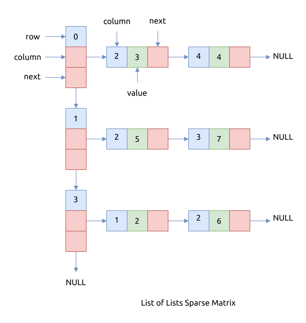

# List of Lists

稀疏矩阵的一种可能表示是列表嵌套 (List of Lists, LIL). 其中一个列表用于表示行, 每行包含三元组列表:
列索引, 值 (非零元素) 和非零元素的地址字段.
为了获得最佳性能, 两个列表都应按升序键的顺序存储.

以下面的矩阵为例:

\begin{bmatrix} \\
0 & 0 & 3 & 0 & 4 \\\\
0 & 0 & 5 & 7 & 0 \\\\
0 & 0 & 0 & 0 & 0 \\\\
0 & 2 & 6 & 0 & 0 \\
\end{bmatrix}

这个矩阵用数组存放, 效果如下图:



这种存储方式的特点是:

- Row major 风格
- 分两层链表来存储
    - 第一层是行级链表, 存储非空行, 且以行号递增排序
    - 第二层, 在每个行链表节点中, 存储非空列的链表, 且以列号递增排序
- 查找矩阵中某个节点的值时的性能是 `O(m * n)`, 其中 `m` 和 `n` 是矩阵中非 0 元素的最大行列数, 目前使用的是顺序查找,
  效率比较低
- 比较适合存放随时增减节点的矩阵, 插入或者删除元素的成本比较低, 很灵活, 但缓存不友好

## 算法的实现

为了简化实现, 我们使用了标准库中的双向链表实现.

比较复杂的操作是插入和删除节点, 这个要同时判断行列表和列列表都是有效的.

```rust
{{#include assets/list_of_lists_sparse_matrix.rs:5:154}}

{{#include assets/traits.rs:5:}}
```