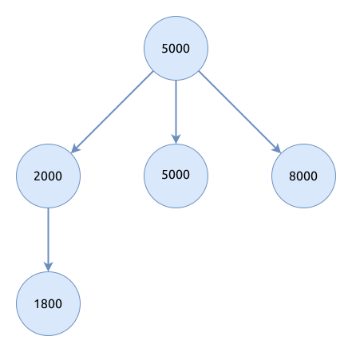
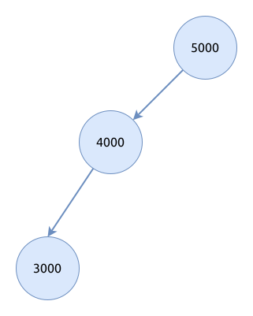
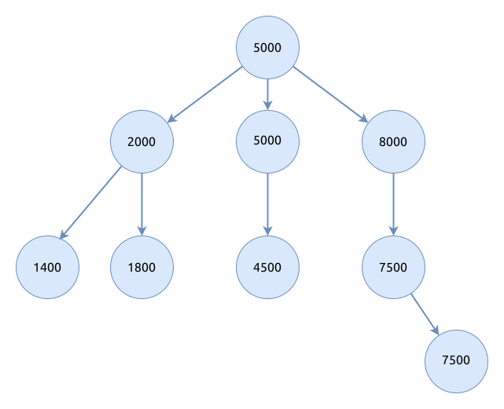

# 计算三叉搜索树的高度

## 题目描述

定义构造三叉搜索树规则如下:

每个节点都存有一个数, 当插入一个新的数时, 从根节点向下寻找, 直到找到一个合适的空节点插入.

查找的规则是:

- 如果数小于节点的数减去500, 则将数插入节点的左子树
- 如果数大于节点的数加上500, 则将数插入节点的右子树
- 否则, 将数插入节点的中子树

给你一系列数, 请按以上规则, 按顺序将数插入树中, 构建出一棵三叉搜索树, 最后输出树的高度.

### 输入描述

第一行为一个数 N, 表示有 N 个数, `1 ≤ N ≤ 10000`

第二行为 N 个空格分隔的整数, 每个数的范围为 `[1,10000]`

### 输出描述

输出树的高度 (根节点的高度为1)

### 示例1

输入:

```text
{{#include assets/input1.txt}}
```

输出:

```text
{{#include assets/output1.txt}}
```

说明:



### 示例2

输入:

```text
{{#include assets/input2.txt}}
```

输出:

```text
{{#include assets/output2.txt}}
```

说明:



### 示例3

输入:

```text
{{#include assets/input3.txt}}
```

输出:

```text
{{#include assets/output3.txt}}
```

说明:



## 题解

### Python

```python
{{#include solution.py:5:}}
```

### Rust

```rust
{{#include src/main.rs:5:}}
```
