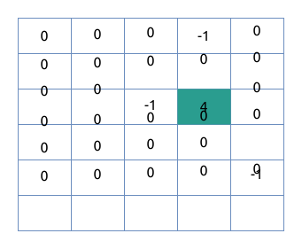

# 计算网络信号/信号强度

## 题目描述

网络信号经过传递会逐层衰减, 且遇到阻隔物无法直接穿透, 在此情况下需要计算某个位置的网络信号值.
注意: 网络信号可以绕过阻隔物.

- array[m][n] 的二维数组代表网格地图
- array[i][j] = 0代表i行j列是空旷位置
- array[i][j] = x(x为正整数)代表i行j列是信号源, 信号强度是x
- array[i][j] = -1代表i行j列是阻隔物
- 信号源只有1个, 阻隔物可能有0个或多个
- 网络信号衰减是上下左右相邻的网格衰减1

现要求输出对应位置的网络信号值.

### 输入描述

输入为三行:

- 第一行为 m, n, 代表输入是一个 m × n 的数组
- 第二行是一串 m × n 个用空格分隔的整数. 每连续 n 个数代表一行, 再往后 n 个代表下一行, 以此类推. 对应的值代表对应的网格是空旷位置,
  还是信号源, 还是阻隔物
- 第三行是 i j, 代表需要计算array[i][j]的网络信号值

注意: 此处 i 和 j 均从 0 开始, 即第一行 i 为 0.

```text
6 5  
0 0 0 -1 0 0 0 0 0 0 0 0 -1 4 0 0 0 0 0 0 0 0 0 0 -1 0 0 0 0 0
1 4
```

代表如下地图:



需要输出第1行第4列的网络信号值, 值为2:


### 输出描述

输出对应位置的网络信号值, 如果网络信号未覆盖到, 也输出0.

一个网格如果可以途径不同的传播衰减路径传达, 取较大的值作为其信号值.

### 示例1

输入:

```text
{{#include assets/input1.txt}}
```

输出:

```text
{{#include assets/output1.txt}}
```

### 示例2

输入:

```text
{{#include assets/input2.txt}}
```

输出:

```text
{{#include assets/output2.txt}}
```

## 题解