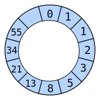

# 环形缓冲区 Circular Buffer

环形缓冲区 Circular Buffer 又称为 Ring Buffer, Cyclic Buffer 或者 Circular Queue.

环形缓冲区是线性数据结构, 通常由数组来实现, 如下图所示:


将尾部与头部相连, 组成一个环形索引, 逻辑上的关系如下图所示.:



所以才称为环形缓冲区.

环形缓冲区实现的是单生产者-单消费者模式 (single-producer, single-consumer),
生产者将元素加到尾部, 然后消费者从头部读取元素, FIFO (first in first out).

与链表相比, 这种数据结构更加紧凑, 空间利用率高, 对CPU的缓存友好, 常用作 I/O buffering.

## 环形缓冲区的基本操作

TODO(Shaohua):

### 初始化缓冲区

因为缓冲区的容量是事先确定的, 在初始化它的同时, 可以分配好相应的堆内存.
如果分配内存失败, 就直接产生 `panic` 异常.

函数签名是:
`pub fn new(capacity: usize) -> Self`

### 向缓冲区中加入元素

函数签名是:
`pub fn push(&mut self, value: T) -> Result<(), T>`

生产者调用它, 加入元素时, 如果缓冲区已经满了, 就直接返回 `Err(value)`. 为了简化实现, 我们并没有定义相应的
错误类型.

### 从缓冲区中读取元素

消费者调用它, 每次读取一个元素.

函数签名是: `pub fn pop(&mut self) -> Option<T>`

如果缓冲区已经空了, 就返回 `None`

## 环形缓冲区的实现

考虑到性能, 下面的 `CircularBuffer` 使用了几个 `unsafe` 接口, 要特别留意指针的操作.

```rust
{{#include assets/circular_buffer.rs:5:178}}
```

## 环形缓冲区的应用

有不少软件有使用它来管理缓冲区, 下面就列举几个.

- [linux kernel](https://github.com/torvalds/linux/blob/master/include/linux/circ_buf.h)
- [cpp boost](https://www.boost.org/doc/libs/1_85_0/doc/html/circular_buffer.html)

比如, 在 linux 内核的网络栈, 接收到对方发送的数据包后, 就先放到对应的环形缓冲区, 并且根据它剩下的空间大小,
来通知发送方调整滑动窗口的大小.

## 参考

- [Circular buffer](https://en.wikipedia.org/wiki/Circular_buffer)
