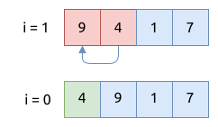
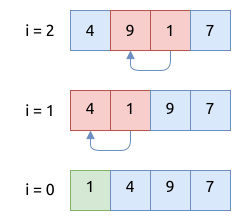
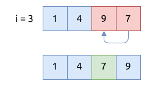

# 侏儒排序 Gnome Sort

侏儒排序又称为愚人排序 (Stupid Sort), 它类似于插入排序, 在移动元素时用到了的方法类似于冒泡排序,
它不需要使用多层循环嵌套.

## 侏儒排序的步骤

侏儒排序将数组分成两部分, 左侧部分是有序的, 右侧部分是无序的. 它只需要一层循环, 用于遍历数组中的所有元素.
将目标元素 `k` 与左侧的有序数组进行比较, 如果它更小, 就与左侧的元素交换位置, 并将循环体中的索引值向左移.
这样的话下次进入循环体时, 仍然访问的是元素 `k`, 然后重复上面的比较操作和交换操作, 直到元素 `k` 被放置在了
合适的位置.

第一阶段, 找到第二个元素 `4`, 将它与第一个元素进行比较并交换位置:



第二阶段, 找到第三个元素`1`, 将它与左侧的元素进行比较并换换位置:



第三阶段, 找到第三个元素`7`, 将它与左侧的元素进行比较并换换位置:



## 侏儒排序的实现

```rust
{{#include assets/gnome_sort.rs:5:24}}
```

## 侏儒排序的特点

- 它的时间复杂度是 `O(n^2)`, 空间复杂度是 `O(1)`
- 对于排序好的数组来说, 时间复杂度是 `O(n)`