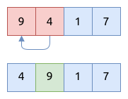
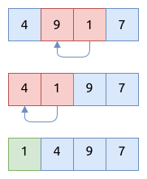
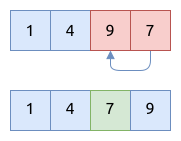

# 插入排序 Insertion Sort

插入排序实现方法比较简单.
它一次排序一个元素, 将数组分成两部分, 左侧部分是有序的, 右侧部分是待排序的.

## 插入排序的步骤

1. 从第二个元素开始遍历数组, 因为数组中的第一个元素是有序的
2. 将第二个元素与第一个元素比较, 如果比第一个元素小, 就交换两者的位置
3. 将第三个元素与第二个位置的元素比较, 如果比它小, 就交换位置, 并重复第2步
4. 继续以上的步骤, 将无序元素与前面的有序的元素进行比较以及交换位置
5. 重复操作, 直到整个数组都是有序的

第一阶段, 将第二个元素 `4` 与第一个元素 `9` 进行比较, 并交换位置:



第二阶段, 将第三个元素 `1` 与前面的元素比较, 并交换位置:



第三阶段, 将第四个元素 `7` 与前面的元素比较并交换位置:



## 插入排序的实现

```rust
{{#include assets/insertion_sort.rs:5:20}}
```

## 递归实现插入排序

根据上面的描述, 插入排序会将数组分成两部分, 左侧部分是已经排好序的, 右侧部分是待排序的.
现在用递归的形式重新实现这个步骤:

1. 对于第 `k` 个元素, 先将 `list[0..k]` 进行递归排序
2. 然后将第 `k` 个元素与前面已经排序好的 `list[0..k]` 进行比较并交换位置, 以便让它放在合适的位置
3. 这样的话, 整个数组最终就会变成有序的

```rust
{{#include assets/insertion_sort.rs:22:43}}
```

## 二分插入排序法 Binary Insertion Sort

二分插入排序法结合了二分查找 (binary search) 与插入排序 (insertion sort).

根据上面的描述, 在对第 `k` 个元素进行排序时, `list[0..k]` 这部分已经是有序的了, 然后拿着第 `k` 个元素与它左侧的每个元素进行比较并交换,
直到找到合适的位置, 这个过程的时间复杂度是 `O(k)`.
但因为 `list[0..k]` 数组已经是有序的了, 我们可以利用二分查找法 (binary search) 快速查找到第 `k` 个元素合适的位置,
这个过程的时间复杂度是 `O(log k)`.

算法的实现如下所示:

```rust
{{#include assets/insertion_sort.rs:58:102}}
```

上述优化对选择排序的影响不大, 主要原因是耗时的操作在于移动数组中的元素, 而不是查找元素的合适位置.

## 插入排序的特点

- 时间复杂度是 `O(N^2)`, 空间复杂度是 `O(1)`
    - 如果传入的数据是增序排好的, 那么只需要 N-1 次的比较, 以及 0 次的交换
    - 如果传入的数据是降序排好的, 那么需要 N^2/2 次的比较, 以及 N^2/2 次的交换
    - 如果是乱序的, 大概需要 N^2/4 次的比较, 以及 N^2/4 次的交换
- 插入排序是稳定排序 (stable sort)
- 它是原地排序 in-place sort
- 插入排序比较适合元素较少的数组
- 插入排序适合基本已排序好的数组
- 插入排序常用于组合排序算法中, 用于排序较少元素的部分数组; 比如 cpp 里面的 `std::sort()` 以及 python
  里的 `timsort()`