# 归并排序 Merge Sort

归并排序是 [分治算法](../divide-and-conquer/index.md) 的经典实现.
它将数组分成较小的数组并排序, 然后再将它们合并在一起, 得到的数组就是有序的了.

## 归并排序的步骤

1. 分隔 divide: 将数组递归分成两部分子数组, 直到每部分只剩下一个元素为止
2. 攻克 conquer: 使用分治算法排序每个子数组
3. 合并 merge: 将排序好的子数组有序合并在一起

第一阶段: 将数组递归分隔 (partition) 成左右两部分:



第二阶段, 将子数组合并在一起:



## 归并排序的实现

```rust
{{#include assets/merge_sort.rs:15:76}}
```

## 元素较少时, 使用插入排序

在排序阶段, 如果数组元素较少时仍然使用递归的归并排序的话, 并不划算, 因为会有大量的递归分支被调用,
还可能导致栈溢出. 为此我们设置一个常量, `CUTOFF=24`, 当数组元素个数小于它时, 直接使用插入排序.

另外, 我们还在递归调用之前, 创建了辅助数组 `aux`, 这样就可以在合并时重用这个数组, 以减少内存的分配.

```rust
{{#include assets/merge_sort.rs:78:148}}

{{#include assets/insertion_sort.rs:5:20}}
```

## 元素较少时, 使用希尔排序

这个方法是基于以上方法, 用希尔排序来代替插入排序, 可以得到更好的性能. 而且 `CUTOFF` 值也可以更大一些.
经过几轮测试发现, 对于希尔排序来说, `CUTOFF` 的取值位于 `[64..92]` 之间时, 性能较好.

```rust
{{#include assets/merge_sort.rs:150:185}}

{{#include assets/merge_sort.rs:115:148}}

{{#include assets/shell_sort.rs:5:34}}
```

## 归并排序的特点

- 归并排序的时间复杂度是 `O(N log(N))`, 空间复杂度是 `O(N)`
