# 归并排序 Merge Sort

归并排序是 [分治算法](../divide-and-conquer/index.md) 的经典实现.
它将数组分成较小的数组并排序, 然后再将它们合并在一起, 得到的数组就是有序的了.

## 归并排序的步骤

默认实现的递归排序是自顶向下(top-down merge sort)的, 即将整个数组递归分隔.

1. 分隔 divide: 将数组递归分成两部分子数组, 直到每部分只剩下一个元素为止
2. 攻克 conquer: 使用分治算法排序每个子数组
3. 合并 merge: 将排序好的子数组有序合并在一起

第一阶段: 将数组递归分隔 (partition) 成左右两部分:


第二阶段, 将子数组合并在一起:


## 归并排序的实现

```rust
{{#include assets/merge_sort.rs:15:76}}
```

## 归并排序的特点

- 归并排序的时间复杂度是 `O(n log(n))`, 空间复杂度是 `O(N)`

## 元素较少时, 使用插入排序

在排序阶段, 如果数组元素较少时仍然使用递归的归并排序的话, 并不划算, 因为会有大量的递归分支被调用,
还可能导致栈溢出. 为此我们设置一个常量, `CUTOFF=24`, 当数组元素个数小于它时, 直接使用插入排序.

另外, 我们还在递归调用之前, 创建了辅助数组 `aux`, 这样就可以在合并时重用这个数组, 以减少内存的分配.

```rust
{{#include assets/merge_sort.rs:78:148}}

{{#include assets/insertion_sort.rs:5:20}}
```

## 元素较少时, 使用希尔排序

这个方法是基于以上方法, 用希尔排序来代替插入排序, 可以得到更好的性能. 而且 `CUTOFF` 值也可以更大一些.
经过几轮测试发现, 对于希尔排序来说, `CUTOFF` 的取值位于 `[64..92]` 之间时, 性能较好.

```rust
{{#include assets/merge_sort.rs:150:185}}

{{#include assets/merge_sort.rs:115:148}}

{{#include assets/shell_sort.rs:5:34}}
```

## 迭代形式实现的归并排序

迭代形式的归并排序, 又称为自下而上的归并排序 (bottom-up merge sort).
它的步骤如下:

- 将连续的 2 个元素比较并合并在一起
- 将连续的 4 个元素比较并合并在一起
- 重复以上过程, 直到所有元素合并在一起

下面的流程图展示了一个简单的操作示例:



对应的代码实现如下:

```rust
{{#include assets/merge_sort.rs:197:232}}

{{#include assets/merge_sort.rs:120:153}}
```

## 三路归并排序 3-way merge sort

默认实现的归并排序, 是将数组分成左右两部分分别排序. 三路归并排序, 是将数组分成左中右三部分分别排序.

```rust
{{#include assets/merge_sort.rs:245:368}}
```

三路归并排序的特点:

- 时间复杂度是 `O(n log_3(n))`, 空间复杂度是 `O(n)`
- 但因为在 `merge_xx()` 函数中引入了更多的比较操作, 其性能可能更差

## 原地归并排序

原地归并排序, 是替代了辅助数组, 它使用类似插入排序的方式, 将后面较大的元素交换到前面合适的位置.
尽管省去了辅助数组, 但是因为移动元素的次数显著境多了, 其性能表现并不好.

下面的流程图展示了一个原地归并排序的示例:



```rust
{{#include assets/merge_sort.rs:370:426}}
```

原地归并排序的特点:

- 时间复杂度度是 `O(N^2 Log(N))`, 空间复杂度是 `O(1)`
- c++ 的标准库里有实现类似的算法, 参考 [inplace_merge](https://en.cppreference.com/w/cpp/algorithm/inplace_merge)

## 优化原地归并排序

上面的原地归并排序, 每次只移动一个元素间隔. 类似于希尔排序, 我们可以增大移动元素的间隔 (gap), 来减少
移动元素的次数.

```rust
{{#include assets/merge_sort.rs:427:486}}
```

- 时间复杂度度是 `O(n log(n) log(n))`, 空间复杂度是 `O(1)`
