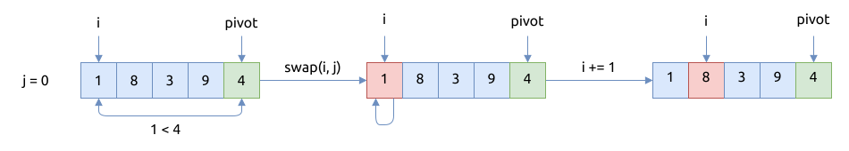
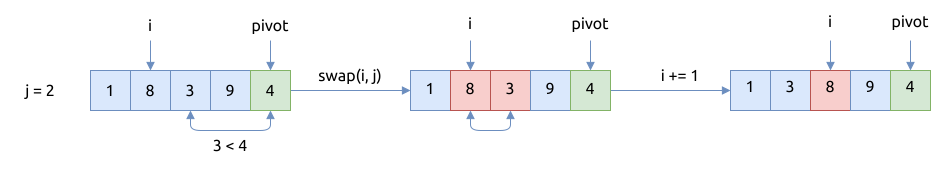
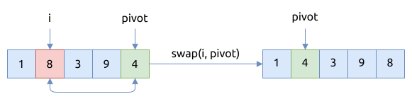

# 快速排序 Quicksort

与归并排序类似, 快速排序也是[分治算法](../divide-and-conquer/index.md) 的经典实践.

选择基准值 pivot 的方法有多种, 比如:

- 总是选择第一个元素
- 总是选择最后一个元素
- 从数组中随机选择一个元素
- 选择数组中的中值 median

## 快速排序的步骤

快速排序的关键在于基准值 pivot 的选择.

1. 我们选取数组的最后一个元素作为基准值 pivot, 分隔数组为左右两部分
    1. 使用变量 `i` 标记当前比基准值大的元素位置
    2. 遍历数组, 把比基准值小的元素交换到 `i` 的左侧, 比基准值大的元素留在元素 `i` 的右侧
    3. 最后, 把元素 `i` 与数组最右侧的基准值元素交换位置, 这样就把基准值放在了它的最终位置
2. 将数组分成两部分, 左侧部分的元素值都比基准值小, 右侧部分比基准值大
3. 然后递归调用快速排序算法, 对左右两侧子数组进行排序

下面以 `arr = [1, 8, 3, 9, 4];` 为例子展示如何对数组分区.

首先选择最后一个元素 `4` 作为基准值 pivot.
将第一个元素 `1` 与基准值比较, 它比基准值小, 就需要交换元素 `swap(i, j)`, 并将索引 `i` 右移一位:



将第二个元素 `8` 与基准值比较, 它比基准值大, 就什么都不做:



将第三个元素 `3` 与基准值比较, 它比基准值小, 就需要交换元素 `swap(i, j)`, 并将索引 `i` 右移一位:



将第四个元素 `9` 与基准值比较, 它比基准值大, 就什么都不做:



最后一步, 将基准值 pivot 元素与当前的元素 `i` 进行交换, 这样的话 pivot 就被移动到了它的最终位置:



## 快速排序的实现

默认使用最后一个元素作为基准值 pivot. 如果是已排序好的数组, 这种算法是最差情况, 时间复杂度是 `O(n^2)`.

```rust
{{#include assets/quicksort.rs:7:56}}
```

## 快速排序的特点

- 最好情况的时间复杂度是 `O(n log(n))`, 平均情况下的时间复杂度是 `O(n log(n))`
- 最差情况的时间复杂度是 `O(n^2)`, 因为选择的基准值 pivot 很不合适
- 如果不考虑递归调用的栈空间, 快速排序的空间复要度是 `O(1)`
- 如果考虑递归调用的栈空间, 最好情况下的空间复杂度是 `O(log(n))`, 最差情况下的空间复杂度是 `O(n)`
- 不是稳定排序 (stable sort). 如果所需的排序算法不要求是稳定排序的, 那么我们应该优先考虑快速排序及其变体
- 是原地排序 (in-place sort), 不需要辅助数组
- 比归并排序 (merge sort) 要快, 不需要一个额外的数组来保存中间值
- 它适对对大数据集做排序, 效率高; 不适合排序小的数据集
- 快速排序是缓存友好型的 (cache-friendly), 能充分发挥缓存的局部性优势, 因为它是顺序遍历数组的

## 使用第一个元素作为基准值

上面我实现的分区算法, 使用最后一个元素作为基准值 pivot.
我们也可以选取数组的第一个元素作为基准值, 但如果数组已经是逆序排序的, 这种算法是最差情况,
时间复杂度是 `O(n^2)`.

算法实现如下:

```rust
{{#include assets/quicksort.rs:58:105}}
```

## 双指针风格的分区算法

上面的代码中, 我们都使用变量 `j` 来遍历数组, 这里我们也可以使用靠拢型双指针的写法遍历数组.

```rust
{{#include assets/quicksort.rs:107:160}}
```

## 当元素较少时, 使用插入排序

当元素较少时, 递归调用快速排序算法会产生非常多的调用分支, 效率很低.
跟之前的优化方法类似, 当元素个数较少时, 我们直接调用插入排序.

```rust
{{#include assets/quicksort.rs:162:193}}
```

## 迭代形式的快速排序

默认情况下实现的快速排序使用了递归形式, 它用了尾递归调用来保存数组的左右边界值.
我们也可以显式地使用一个栈结构来手动保存它们, 就可以将快速排序改写成迭代形式:

```rust
{{#include assets/quicksort.rs:162:193}}
```

## 随机选择一个元素作为基准值 pivot

## 原地分隔数组 (in-place partition)

## 参考

- [Quicksort](https://en.wikipedia.org/wiki/Quicksort)