# Timsort

Timsort 在 Python, Java 等编程语言的标准库中都有使用, 综合性能比较好.

Timsort 是对归并排序(merge sort)的优化.

## Timsort 的步骤

它的优化思路是:

- 先将数组分成相同间隔的子数组, 常用的间隔值是 32 或者 24
- 然后用插入排序(或者考虑用希尔排序) 对这些子数组进行排序, 因为这些子数组比较短小, 插入排序的效率比较高
- 排序后, 依次将子数组合并在一起形成有序的大数组, 直到整个数组变得有序
- 合并子数组的方法与归并排序里一致, 不再详述
- 如果数组中的元素较少, 就只会使用插入排序

下图展示了 timsort 的一个示例:



## Timsort 的实现

```rust
{{#include assets/timsort.rs:5:81}}
```

## Timsort 的特点

- 最差情况下的时间复杂度是: `O(n log(n))`, 最间复杂度是 `O(n)`
- 如果数组已基本有序, 最好情况下的时间复杂度是 `O(n)`
- 是稳定排序, 不是原地排序 (in-place sort)
- 与归并排序不同的是, 它不需要递归调用自身将数组分成左右子数组

## 参考

- [Timsort](https://en.wikipedia.org/wiki/Timsort)
- [Python Now Uses Powersort](https://www.i-programmer.info/news/216-python/15954-python-now-uses-powersort.html)
- [Timsort -- the fastest sorting algorithm you’ve never heard of](https://skerritt.blog/timsort/)