# 栈的基本操作

栈的基本操作包括:

- 入栈 push: 将一个元素加入到栈顶
- 出栈 pop: 从栈顶移出一个元素
- 返回栈顶元素 peek/top: 返回栈顶的元素, 但并不移除它
- is_empty: 检查栈是否为空
- is_full: 检查栈是否已满

## 入栈 push

将一个元素入栈:

- 如果栈已满, 就不能再插入新的元素了, 返回栈已满的错误
- 将栈顶的索引值 `top` 加上 1, 并将新元素加入到栈顶的位置

## 出栈 pop

元素出栈顺序跟其入栈顺序是相反的.

从栈顶移出元素:

- 如果栈已空, 就直接返回栈空的错误
- 将栈顶的索引值 `top` 减去1, 并返回旧的栈顶元素

## 返回栈顶的元素 peek

返回栈顶元素:

- 返回之前先检查栈是否为空, 如果为空, 就直接返回栈空的错误
- 返回当前的栈顶元素, 对栈不做任何改动

## 检查栈是否为空 is_empty

- 检查栈里的 `top` 的值
- 如果 `top == 0`, 则说明栈为空, 返回 `true`
- 否则栈中存有元素, 不为空, 返回 `false`

## 检查栈是否已满 is_full

- 检查栈里的 `top` 的值
- 如果 `top == capacity`, 则说明栈已满, 返回 `true`
- 否则栈未满, 返回 `false`

