# 栈的基本操作

栈的基本操作 ADT, 包括:

- `new(capacity) -> Stack`: 初始化栈, 指定栈的大小
- `push(value: T) -> Result<(), T>`: 将一个元素加入到栈顶
- `pop() -> Option<T>`: 从栈顶移出一个元素
- `top() -> Option<&T>`: 返回栈顶的元素, 但并不移除它
- `is_empty() -> bool`: 检查栈是否为空
- `len() -> usize`: 返回当前栈中包含的元素个数
- `capacity() -> usize`: 对于静态栈, 返回栈的最大容量

## 入栈 push()

将一个元素入栈:

- 如果栈已满, 就不能再插入新的元素了, 返回栈已满的错误
- 将栈顶的索引值 `top` 加上 1, 并将新元素加入到栈顶的位置

如果是动态栈, 不受容量限制, 那这个函数就没有返回值, 也不存在栈满的问题.

## 出栈 pop()

元素出栈顺序跟其入栈顺序是相反的.

从栈顶移出元素:

- 如果栈已空, 就直接返回 `None`
- 将栈顶的索引值 `top` 减去1, 并返回旧的栈顶元素

## 返回栈顶的元素 top()

返回栈顶元素:

- 返回之前先检查栈是否为空, 如果为空, 就直接返回栈空的错误
- 返回当前的栈顶元素, 对栈不做任何改动

## 检查栈是否为空 is_empty()

- 检查栈里的 `top` 的值
- 如果 `top == 0`, 则说明栈为空, 返回 `true`
- 否则栈中存有元素, 不为空, 返回 `false`

## 检查栈中当前的元素个数 len()

直接返回 `len` 属性

## 检查栈的容量 capacity()

直接返回 `capacity` 属性

