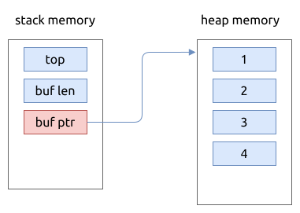

# 栈的实现

## 使用数组实现

使用数组实现的栈结构, 它能保存的元素个数是固定的, 需要在初始化栈时指定栈的容量.

这里, 我们使用 `Box<[Option<T>]>` 用于指示数组中是否存储了元素, 如果它为 `None` 则表示在位置没有元素.

另外一种实现方式是 `Box<[T]>`, 并且要求类型 `T` 实现 `Clone` trait.



```rust
{{#include assets/array_stack.rs:5:99}}
```

## 使用动态数组 Vec 实现动态栈

使用 `Vec<T>` 实现的栈可以进行动态扩容, 但每次扩容时可能要进行内存的批量拷贝.

这个比较简单, 因为 `Vec<T>` 本身就实现了基本的栈操作接口, 我们只需要再包装一下就行:

```rust
{{#include assets/vec_stack.rs:5:70}}
```

## 使用链表实现动态栈

TODO(Shaohua):