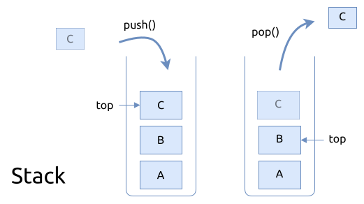

# 栈 Stacks

栈 (stack) 是一个线性数据结构, 内部存放的元素依照先入后出 (last in first out, FILO) 的顺序进行操作.
即先放入栈的元素离栈底较近, 出栈顺序比较晚, 后放入栈的元素离栈顶较近, 出栈顺序较早.

栈的基本结构如下图所示:

跟据栈的大小可以分类为:

- 固定大小的栈: 一旦初始化完成, 便不允许调整栈的大小. 如果当前栈已满, 再向栈顶加入新元素时就会触发
  栈已满的错误; 如果当前栈是空的, 调用pop() 进行出栈时, 就会触发栈已空的错误
- 可以动态调整大小的栈: 可以根据需要进行扩容或者缩容