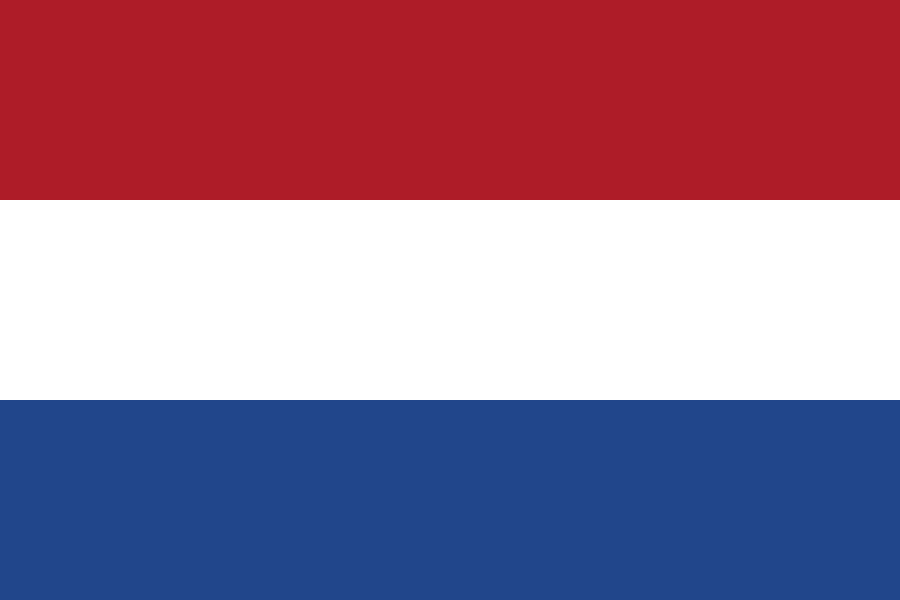

# 靠拢型双指针问题

靠拢型双指针是指使用两个指针从左右两端访问数组, 往中间靠拢直到重叠.

靠拢型指针的一般步骤:

- 初始化左右两个指针, 分别指向数组的左右两端 (left, right)
- 开始遍历数组, 循环中止的条件就是两个指针重叠 ( `left == right`)
- 根据题目要求, 选中左右两个指针中的一个, 往中间靠靠拢 (`left += 1` 或者 `right -= 1`, 另一个指针不动
- 直到循环中止

## Dutch National Flag, DNF

这是上面方法的一个变形, 可以查看问题 [0075. 颜色分类 Sort Colors](../leetcode/0075.sort-colors/index.md),
这个方法用于实现三路分区 (three-way partition).

访问 [wikipedia](https://en.wikipedia.org/wiki/Dutch_national_flag_problem) 查看对应的介绍.

## 相关问题

- [0011. 盛最多水的容器 Container With Most Water](../../leetcode/0011.container-with-most-water/index.md)
