# 快慢型双指针

即访问数组时, 使用两个索引(或指针), 而不是通常的一个索引.

这两个指针中, 有一个快指针 (fast pointer), 用于从0到n依次遍历整个数组;
而慢指针 (slow pointer) 用于让数组中元素实现某个特定条件最高位索引,
比如件条可以是[元素不重复](../leetcode/0026.remove-duplicates-from-sorted-array/index.md).

具体的过程看下图:

这类问题的关键点在于, 如何有效地移动慢指针, 在移动慢指针时, 要对数组做什么样的调整, 比如交换元素, 或者移除元素.