# 并行双指针

这也是一类双指针问题. 用两个指针分别遍历两个数组(或者链表).

- 初始化两个指针, 分别指向两个数组的头部元素
- 如果条件成立, 就同时向右(高位)移动两个指针; 否则, 只移动其中一个, 比如 `ptr1 += 1` 或者 `ptr2 += 1`
- 终止条件是, 直到有一个数组被遍历完

这个方法可以用来处理两个有序数组或者链表的合并; 或者计算两个集合的交集和并集.

## 相关问题